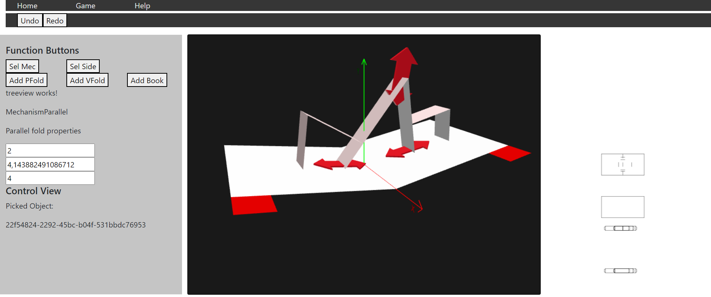

# Popup Webappp

This is a work-in-progress web application based on Angular that aims to allow users to plan and design paper pop-up constructions. It is based on a former [prototyp](https://www.youtube.com/watch?v=jYG2SFkI5Ig) written in C# and Unity. This version uses BabylonJS for 3d-visualization and PaperJS for the 2d-projections.

However, right now it is only possible to configure and stack p-folds on top of each other. 



## How to start

```
npm install
npm start
```

The app is available at `http://localhost:4200`

